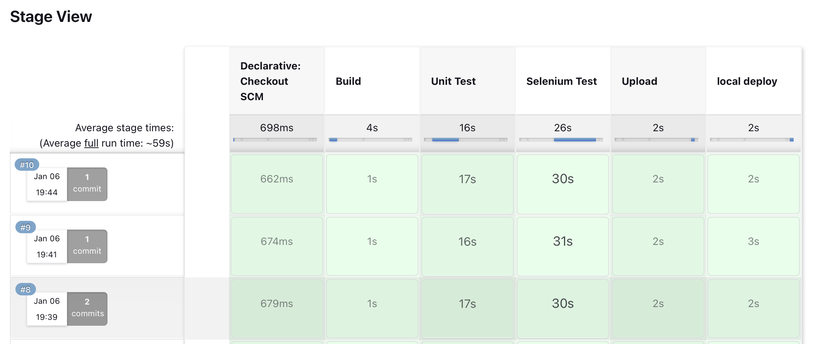
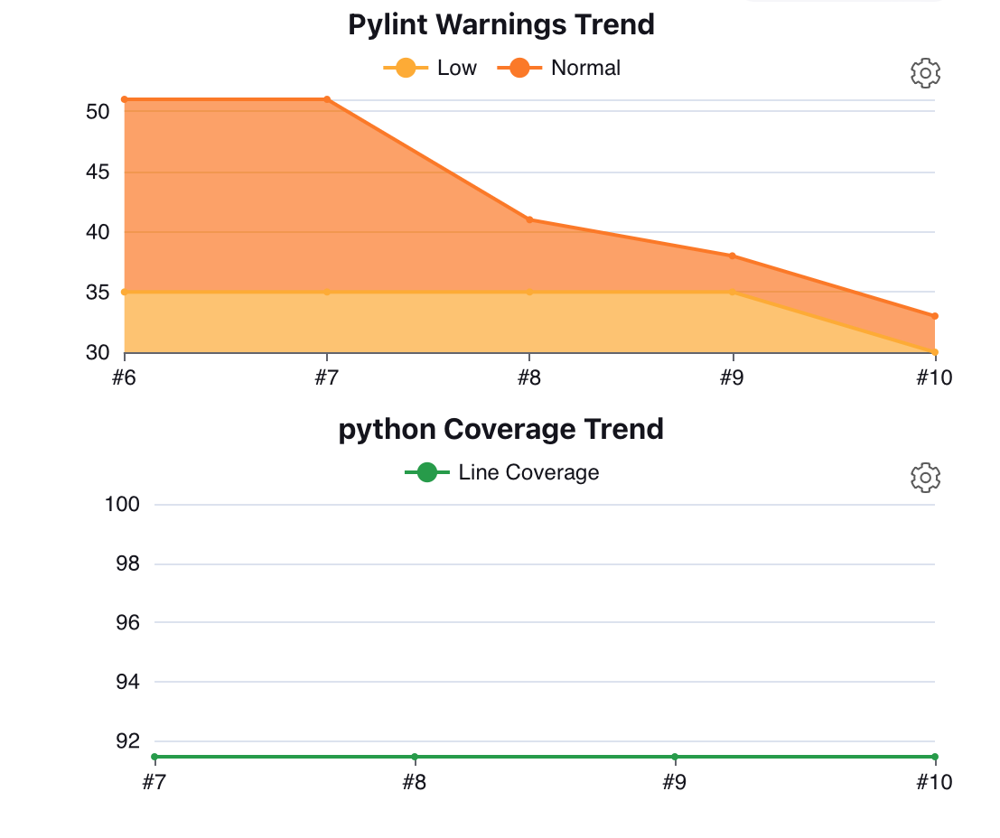
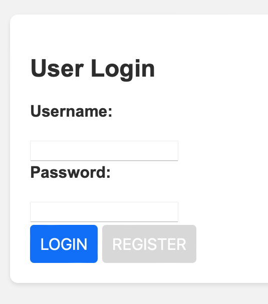
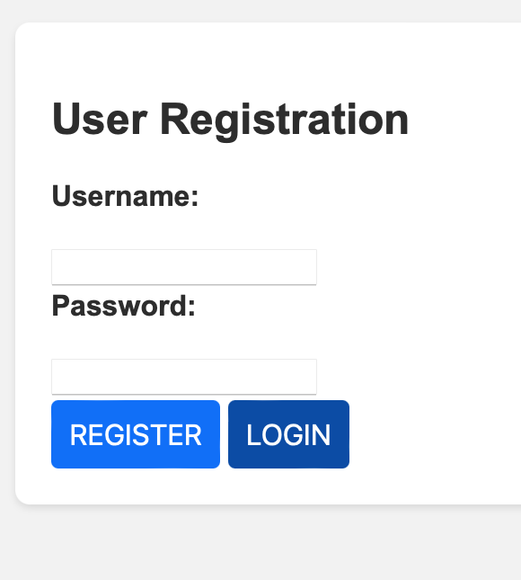
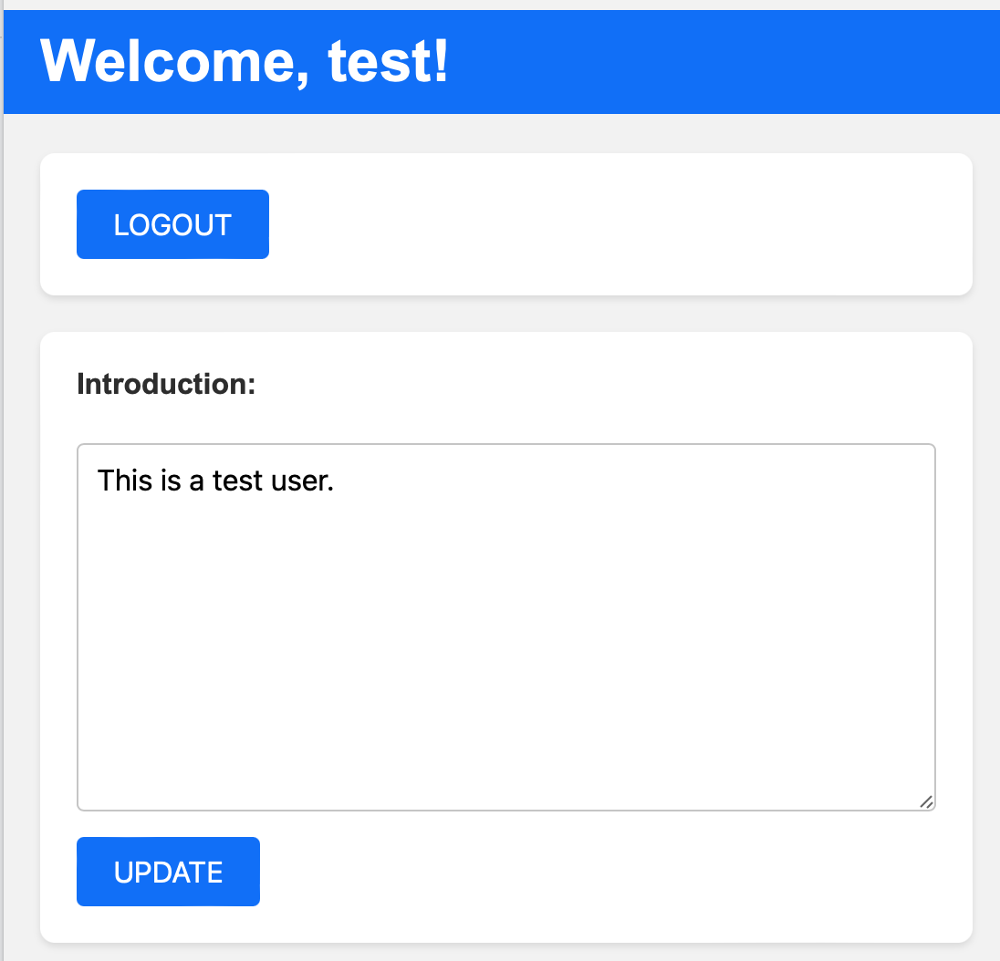

# ProfileWeb Project

---
## Introduction
This project is not just about the final product; it's a journey of learning and skill development. As a CS student, I embarked on this project to deepen my understanding of modern software development practices and tools.

## Learning Outcomes
- **Emphasis on Learning Process:** The primary focus of this project was on the learning process, exploring new tools, and understanding their practical applications in a real-world project.
- **Understanding of CI/CD:** Gained hands-on experience with Continuous Integration and Continuous Deployment (CI/CD) using Jenkins and Docker, learning how to automate and streamline the development process.

## Technology & Features Overview
- **Web Application Development:** Developed a web application using flask as the main of the project. Key functionalities include:
  - **User Account Creation:** Implemented a user registration system allowing new users to create accounts.
  - **User Authentication:** Integrated login and logout capabilities to manage user access securely.
  - **User Profile Management:** Enabled users to update their personal profile.
- **Database Management:** Utilized MongoDB for data storage, ensuring robust and scalable data management.
- **Containerization:** Employed Docker to create isolated environments for both the MongoDB database and the Python web application, enhancing database is security and accessibility by making it accessible only to the server.
- **Continuous Integration/Continuous Deployment (CI/CD) with Jenkins:** Integrated Jenkins for CI/CD, automating the development pipeline, and ensuring smooth, continuous integration and deployment of the application.
- **Testing:** Conducted comprehensive unit testing, include testing with mock objects to verify individual functionalities. And end-to-end testing use selenium to ensure integration of different components.

## Challenges and Solutions

#### Debugging in a Multi-component System
The intricate nature of the project, with its interconnected parts, presented a substantial debugging challenge. A typical issue, such as a failure in user account creation where the new user isn't recorded, could stem from multiple sources. This could range from frontend issues like improper request initiation in the UI, backend mishaps like incorrect request handling on the server, or even disruptions in database connectivity.

To combat this, I used a component-wise testing strategy. This involved:
- Isolating each component: Starting from the user interface, I checked and verified the request initiation and data flow.
- Server-side testing: Moving onto the server, I tested request handling and response generation, ensuring that all processes were functioning as intended.
- Database diagnostics: I examined the database connections and transactions to rule out any issues of data persistence or retrieval.

This comprehensive, step-by-step approach not only enabled me to precisely locate and fix the problems but also enriched my understanding of how different parts of a web application interact and depend on each other. It was a leap forward in my journey as a software developer, equipping me with critical debugging skills and a deeper appreciation for detailed testing and analysis.

## User Story 
#### User Story 1: New User Registration
As a new visitor to the ProfileWeb application,
I want to be able to create a new user account,
So that I can access exclusive features available to registered users.

Acceptance Criteria:

- The homepage should have a clear option to create a new account.
- Upon selecting the option, I should be guided to a registration form.
- The form should require essential details like name, and password.
- There should be a clear indication of successful registration or errors if any.

#### User Story 3: Profile Management
As a logged-in user,
I want to update my profile information,
So that I can keep my personal details up-to-date.

Acceptance Criteria:

- There should be an option to view and edit my profile in the user dashboard.
- I should be able to update the profile.
- Changes should be saved immediately and reflected in my profile.

## Jenkins pipeline

This project is structured around a five-stage pipeline, providing a clear and organized framework for development and troubleshooting. This sequential approach allowing for efficient identification and resolution of any issues that may arise.
Also, integration of Pylint and coverage tools ensures the code quality remains high.

## The UI

  
   
  

